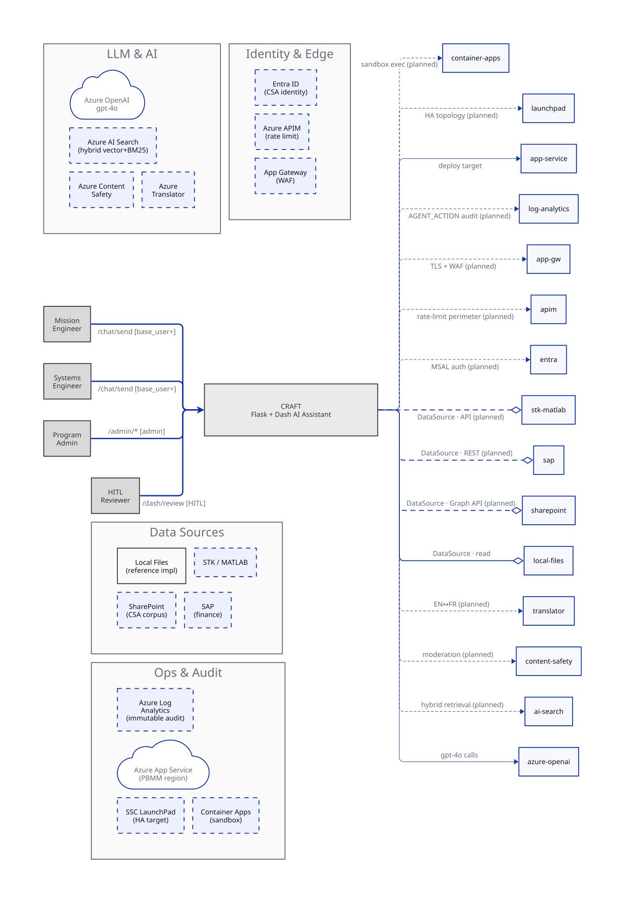
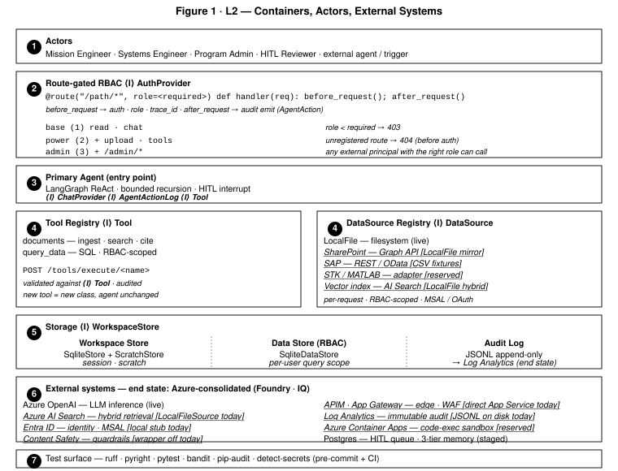

# CRAFT — Pitch Package

## 1. What CRAFT Is

An audited, retrieval-augmented AI assistant for CSA mission engineering and finance. This codebase MVPs the seams. Nothing here ships yet — the pattern shipping is the point.

## 2. Architecture

CRAFT is a Flask + Dash app. Every request enters through a route-gated RBAC layer (see L1, L2). A LangGraph primary agent runs a bounded ReAct loop, binds tools via a `Tool` protocol, and emits `AGENT_ACTION` events after every step. Storage sits behind a `WorkspaceStore` protocol; external corpora sit behind a `DataSource` protocol; connectors line up along the perimeter. The route-gated + audit spine gives the system its safety guarantees — every request checked for auth + role before reaching business logic, every agent step logged with trace IDs for end-to-end reconstruction.

Component views:
- [**L3 Trio**](diagrams/L3-cluster.svg) — agent internals (LangGraph ReAct graph, tool wrappers, audit envelope) · tools & connectors (Tool + DataSource protocols, perimeter connectors) · route + auth (RBAC gates, `_ROUTE_RULES`, test anchors).
- [**UC Trio**](diagrams/UC-cluster.svg) — Risk id + HITL (UC-E2) · Parametric cost + HITL (UC-F1) · Vendor cost + SAP connector (UC-F4).

## 3. Requirements → Design

| Capability | Req IDs | Chosen dep / pattern | Blocker | Ready when… | UC |
|---|---|---|---|---|---|
| Primary agent | UMR-001/011/013/016/018/019/094/095, AAR-001/003/006, ASG-005 | LangGraph ReAct graph · `ChatProvider` protocol · `recursion_limit=25` | none | `ChatProvider` seam; sub-agent = new graph node | E2, F1, F4 |
| Retrieval + RAG | UMR-002/003/004/005/006/009/010/060/067, ARR-002–007 | Azure AI Search (hybrid vector+BM25) · `DataSource` + `Tool` protocols | IT: Azure AI Search deploy; data: source register | new `HybridRetrievalTool` on `Tool` protocol | E2, F1 |
| Audit + traceability | UMR-015/027/045/061/062/093, AAR-005, ASG-003 | `AgentAction` envelope · `AgentActionLog` protocol · JSON lines → Azure Log Analytics | IT: Log Analytics workspace + immutability policy | `AgentActionLog` swappable sink | E2, F1, F4 |
| HITL approvals | UMR-021–026/035/039/044/049, HITL-001–007, ASG-002 | LangGraph `interrupt` primitive · Postgres approval queue · Dash reviewer UI | data: CSA risk-tier taxonomy | `ChatProvider` + interrupt seam; queue = new table | E2, F1 |
| RBAC + data scoping | UMR-012/017/058/065/066, AAR-002/007 | Route-Gated RBAC (`_ROUTE_RULES`, `_ROLE_LEVEL`) + `SqliteDataStore` scoping + `QueryTool.set_user` | none for perimeter; per-tool RBAC pending | `_ROUTE_RULES` list appends; tool-permission column additive | E2, F1, F4 |
| Session + workspace (V3) | UMR-014, UMR-092, UMR-095 | Split `WorkspaceStore` into persistent `SqliteStore` + new `SessionScratchStore` (ephemeral) | design: session-scoped agent lifecycle | `WorkspaceStore` protocol; scratch class = drop-in | dream |
| Guardrails + containment | UMR-020/029/030, ASG-001/004/011 | Azure AI Content Safety · APIM rate limit · Azure Container Apps sandbox (UMR-093) | procurement: Content Safety + Container Apps | tool wrapper adds moderation call; sandbox = new `Tool` class | dream |
| Connectors + external systems | UMR-051–055 | `DataSource` protocol + MSAL (Entra ID / SharePoint) · Flask REST · SAP / STK / MATLAB planned | procurement: SAP integration path; licenses: STK/MATLAB | each connector = new `DataSource` class + `services.py` line | F4 |
| Domain capabilities | UMR-007/008/031–034/036–038/040–043/046–048/050/075, ARR-001 | Each domain = new `Tool` impl over existing seams (retrieval, HITL, audit, RBAC) | data: CSA risk taxonomy, historical mission DB; procurement: Translator for reports | uniform pattern — see § 4 | E2, F1 |
| Deployment, SLA, config | UMR-028/056/057/059/064/069/070/074/085, ASG-006 | Azure App Service (PBMM Canadian region) · APIM + App Gateway (WAF) · SSC LaunchPad HA target · git-versioned config | IT: PBMM landing zone; SSC LaunchPad readiness | env-var config; migrations = numbered SQL | dream |

## 4. Use Cases

**UC-E2 · Risk identification + HITL (Engineering).** A mission engineer uploads a CADRe Part A document. The primary agent retrieves relevant risk sections, runs a keyword + LLM classifier, flags risks — then hits a HITL gate. A reviewer approves or rejects; approved risks write to the risk register (planned). [View state model →](diagrams/UC-cluster.svg#row1)

**UC-F1 · Parametric cost estimation + HITL (Finance).** A program admin requests a cost estimate for a new mission profile. The agent retrieves 5 most-similar historical missions, computes a weighted Euclidean distance, presents the estimate — then hits a HITL gate before commitment. [View state model →](diagrams/UC-cluster.svg#row2)

**UC-F4 · Vendor cost roll-up + SAP connector.** A finance analyst queries vendor costs across past programs. The agent routes through a planned SAP connector implementing `DataSource`, extracts vendor line items, aggregates, and audits. Blocked on SAP integration — the `DataSource` seam is proven with LocalFileSource. [View state model →](diagrams/UC-cluster.svg#row3)

Other flows use the same spine. Parametric budget scenarios, vendor-cost aggregation across missions, anomaly triage, bilingual report drafting, cross-mission telemetry compare, cost-per-requirement decomposition — each lands as a new `Tool` implementation plus (where needed) a new `DataSource`. Retrieval, RBAC scoping, HITL gates, `AGENT_ACTION` audit envelope: unchanged. No new architecture. Timeline gated by the blockers in § 5.

## 5. What's Blocked, What We're Ready For

- **Azure AI Search Serverless deploy** (IT + procurement) — unlocks hybrid retrieval, citations, faithfulness scoring. Seam: `DataSource` + new `HybridRetrievalTool`.
- **Azure Log Analytics workspace + immutability policy** (IT) — unlocks tamper-proof audit at UMR-027 grade. Seam: `AgentActionLog` swappable sink.
- **Azure AI Content Safety + Container Apps sandbox** (procurement) — unlocks UMR-020 guardrails + UMR-093 sandboxed code exec. Seam: tool wrapper moderation, new `CodeExecTool`.
- **Entra ID app registration + SharePoint / SAP connectors** (IT + finance team) — unlocks CSA-native corpus + cost data. Seam: each = new `DataSource` class.
- **CSA risk taxonomy + risk register schema** (CSA domain) — unlocks UMR-036–040 and the HITL flows around risk writes.
- **Historical mission DB + parametric feature schema** (CSA finance / mission engineering) — unlocks UMR-031–035 cost estimation.
- **SSC LaunchPad availability** (SSC) — unlocks HA topology for UMR-057.

## 6. System-Health Tooling

| Tool | Purpose | Runs where |
|---|---|---|
| **ruff** | Lint (replaces flake8, isort, pyupgrade) | pre-commit + CI |
| **pyright** | Strict type checking, no `# type: ignore` | pre-commit + CI |
| **pytest + pytest-cov** | 156 tests, ~91% coverage, ≥80% threshold enforced | pre-commit + CI |
| **bandit** | Static security scan | pre-commit |
| **pip-audit** | CVE audit of installed deps | pre-commit |
| **detect-secrets** | Prevent committing credentials | pre-commit |

`app/tests/test_architecture.py` auto-discovers feature folders and enforces: no cross-feature internal imports (protocol boundaries), required files per feature, root file whitelist. `app/tests/test_rules.py` adds: logging coverage audit, no hardcoded secrets, function length caps, import completeness. Same suite runs `.pre-commit-config.yaml` and `.github/workflows/ci.yml`. New invariant = new test. Local warning + CI gate, no extra infra.